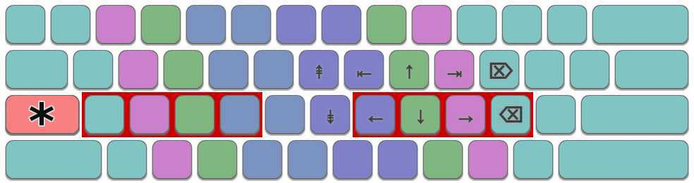

Colemak layout with Qwerty hotkeys for Linux. Tested on Ubuntu 20.04, i3wm.


# Installation

```
$ git clone https://github.com/the-devil-you-know/colemak-qwerty-x11-xkb.git
$ xkbcomp colemak-qwerty-x11-xkb/.xkb_keymap_us $DISPLAY
```
**Congratulations! Everything is ready!**

During the installation you may see a lot of warnings, don't worry about it.


# Personalization

This layout has remappings:

1. Return is mapped to the Alt_r
2. Mode_switch to the Caps
3. Ctrl_l to the Alt_l
4. Alt_l to the Ctrl_l

If you don't need it, remove from the **.xkb_keymap_us**:
```
key <RALT> { actions[Group1]=[ RedirectKey(keycode=<RTRN>) ] };
key <LALT> { [ Control_L, Control_L ] };
key <LCTL> { [ Alt_L ] };
key <CAPS> { [ Mode_switch ] };

modifier_map Control { <LALT> };
modifier_map Mod1 { <LCTL> };
```


# Additional features



### Extra layout

Hold down the **Mode_switch** (which is mapped to the **Caps**) and you will have a layout like in the picture above.

### Improve Mode_switch by Xcape

To assign an additional one-click function to the **Mode_switch**, you can use xcape. It is possible to have **Caps** work as **Escape** when pressed alone, and as **Mode_switch** when used with another key. 

```
$ xcape -e 'Mode_switch=Escape'
```

If you hold a key for longer than the timeout value (default 500 ms), xcape will not generate a key event.

Read more: https://github.com/alols/xcape
